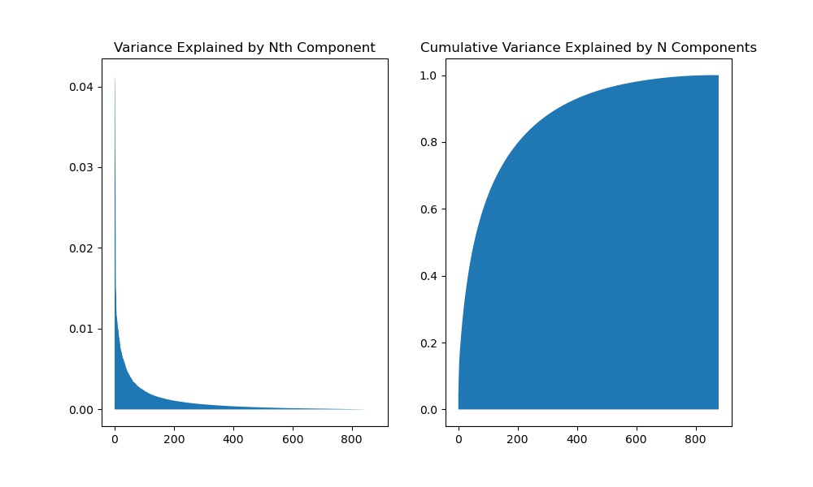

# MVP - ## Auto FAQ

After obtaining almost 2000 features from our data, we used countVectorizer and TFIDF Vectorizer to with stopwords and min & max df to reduce it down to almost 1000, we can still vusualize the our data with pca in 2 -dimensional space. We can see from the above image that we will need less than 1/4 to explain more than 80% of our data. I will continue to explore the topics with this tecnique with NMF.