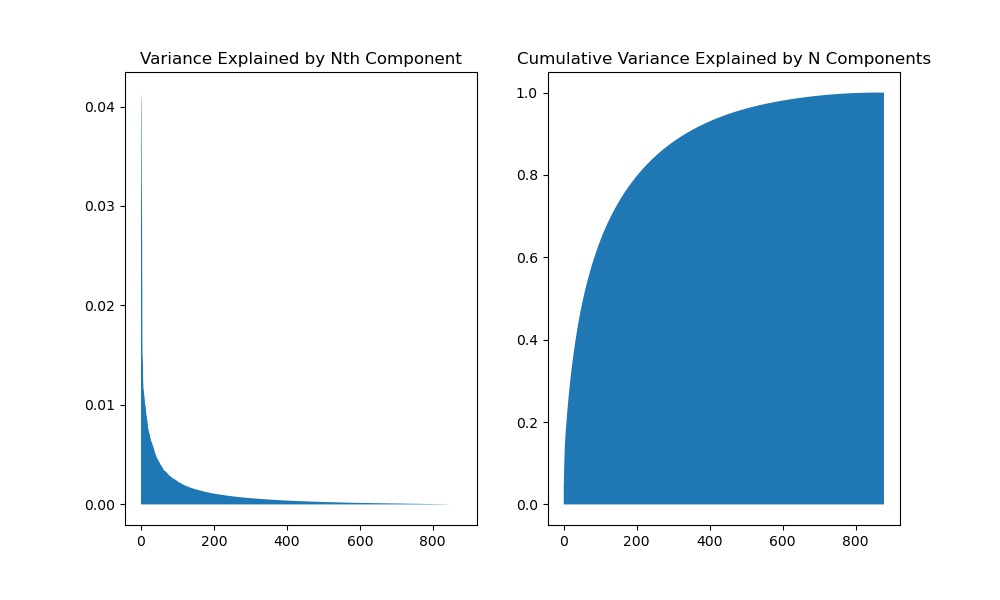

# NLP PROJECT: - Auto FAQ Answering

## Final Write-up

### Abstract:

2020 has shown companies the need to automate certain tasks and minimize physical interaction with customers.
We hear a lot about Chatbots these days, chatbots are the solution for consumer frustration regarding customer care call assistance. They provide modern-day virtual assistance for simple problems of the customer and offload low-priority, high turnover tasks which require no skill. In this project, I will use natural language processing to automate a bank customer response in an a frequently asked section be means of semantically understunding the the querry, and returning the best possible answer.

### Design

- I gathered data from the web
- I explored some key topics on frequently asked questions
- I built a recomendation system to recommend the best answer from a given question from a user.
- Created a flask app which has been deployed on heroku.

### Data

- Used a public dataset by HDFC bank and can be lecated [here on kaggle](https://www.kaggle.com/abbbhishekkk/faq-datasets-for-chatbot-training?select=HDFC_Faq.txt)
- The data contains over 7000 real customer questions, and each question is associated with a profesion response from the bank associate.

### Algorithm

#### EDA

After obtaining almost 2000 features from our data, we used countVectorizer and TFIDF Vectorizer to with stopwords and min & max df to reduce it down to almost 1000, we can still vusualize the our data with pca and SVD in 2 -dimensional space. We can see from the above image that we will need less than 1/4 of the data to explain more than 80% of our data. I will continue to explore the topics with this tecnique and with NMF.

### Modeling

- Cleaned the data by replacing some characters with actual words, for instance '/' with 'or'. God rid of numeric and extra punctuation that might create just noise during modeling

- Vectorized with both countVectorizer and Term-Frequency inverse document frequency, in the end chose TFIDF as the final vectorizer.
- Used matrix factorization (NMF and SVD) techniques to perform dimensionality reduction. I Used a research paper by Gavish & Donoho (IEEE Transaction Information Theory, Vol.60(8), https://papers.nips.cc/paper/2017/file/f231f2107df69eab0a3862d50018a9b2-Paper.pdf ) to truncate the svd to optimal number of components.
- Used the reduced dimensions to build a recomendation to predict the clossest question using cosine similarity and returning the corresponding answer.

### Tools:

- Data Acquisition and storage and Modeling
  - Python
  - pandas
  - NLTK
  - Scikit-learn

### Future work

- Deployment
  - Flask
  - Docker
  - Heroku
